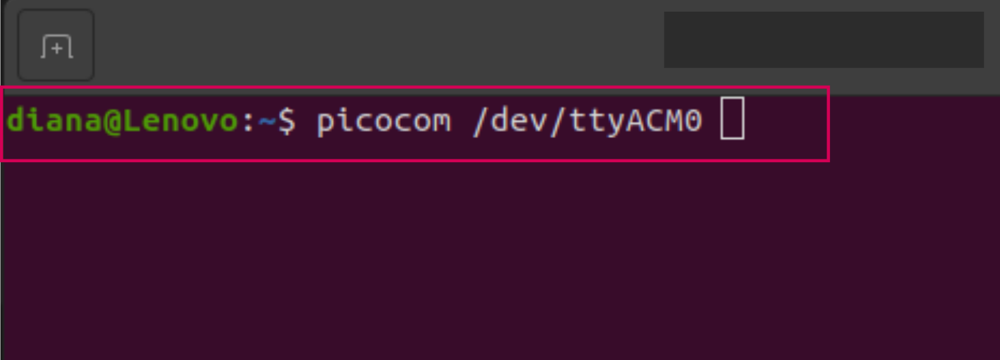
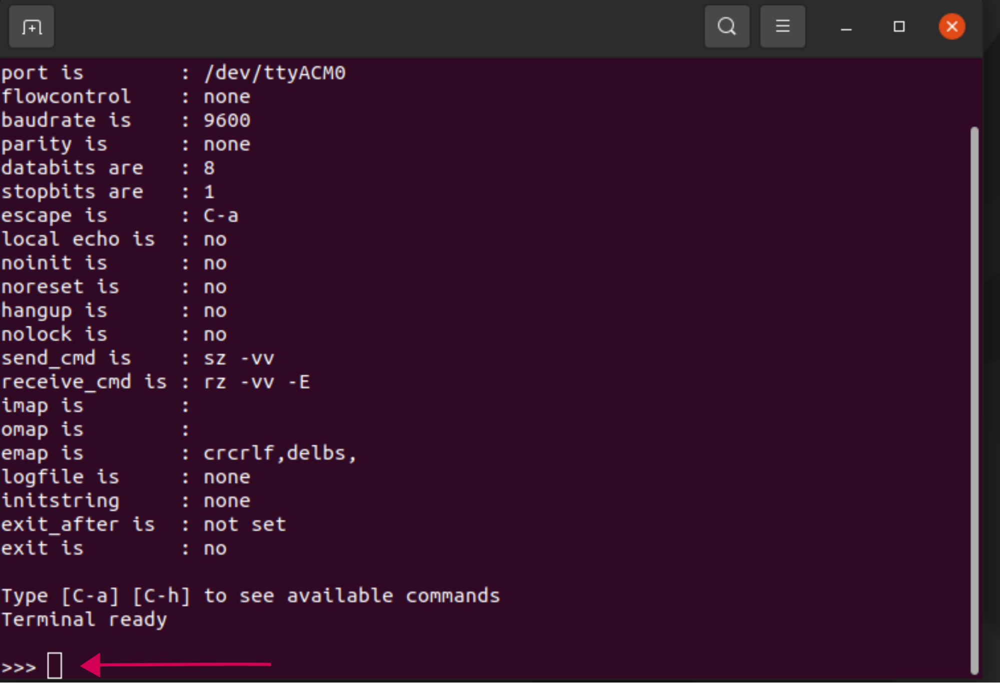
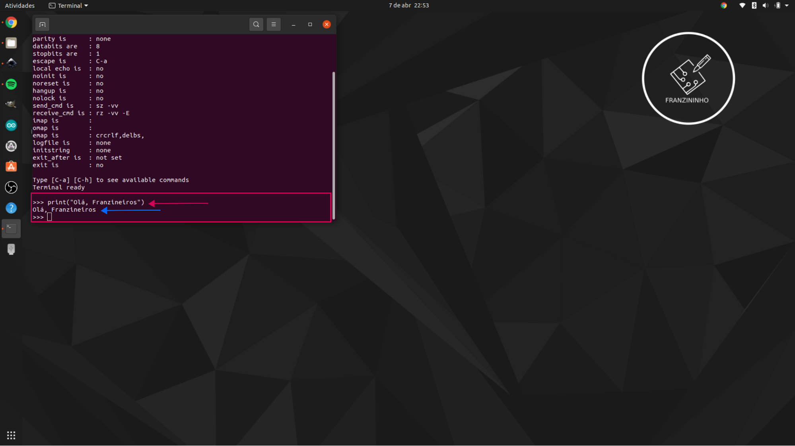
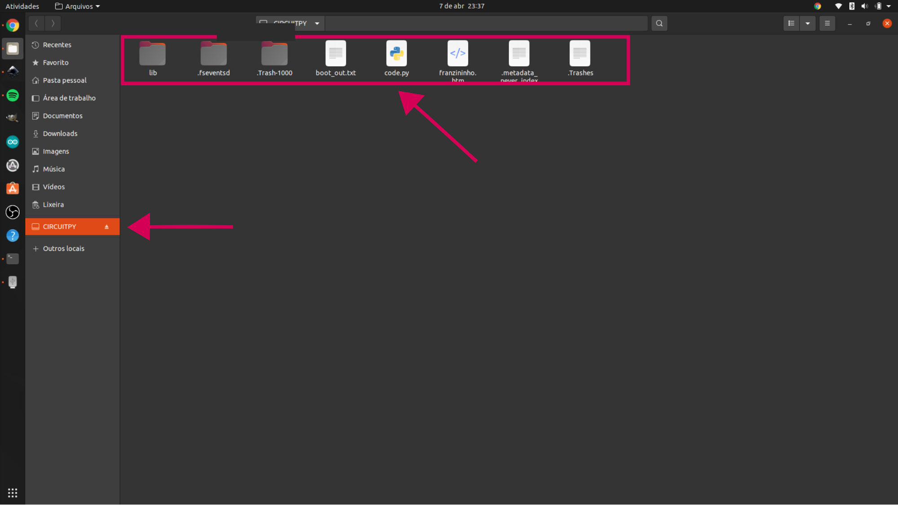

# Primeiros passos com CircuitPython no Franzininho Wifi

Para iniciar no CircuitPython é importante você entender como interagir com REPL. Nesses primeiros passos vamos aprender a como usar o REPL através do terminal serial.

## Terminal

O primeiro passo é conectar a placa Franzininho Wifi em seu computador e logo irá aparecer algo parecido com um dispositivo de pen drive, conforme a imagem abaixo:


Antes de sair abrindo os arquivos, faça o seguinte passo:


1 - Conecte a Franzininho

2 - Abra o terminal

3 - Instale um terminal, por exemplo, para instalar o picocom, digite os comandos abaixo:


```
sudo apt-get update
sudo apt-get install picocom
```

4 - Para acessar o terminal serial, digite o seguinte comando: picomcom /dev/ttyACM0 de enter.




5 - Agora aperte  o Ctrl C do teclado e então aparecerá >>>




6 -  No terminal digite: print(“Hello World”) e aperte o enter (você pode escrever qualquer coisa dentro das aspas, então aparecerá o que você escreveu.



7 - Agora vamos fazer uma operação matemática, digite um valor | escolha uma operação matemática e digite outro valor, aperte o enter e veja o resultado, conforme a imagem:


8 - Agora digite o seguinte código no terminal:

```python
import board
dir(board)
```

Então aparecerá o conjunto de pinos disponíveis na Franzininho Wifi.


Agora que você já sabe quais são os nomes dos pinos da placa e também interagir com REPL. Podemos fechar o terminal e dar início abrindo o arquivo **code.py** que está na pasta.



