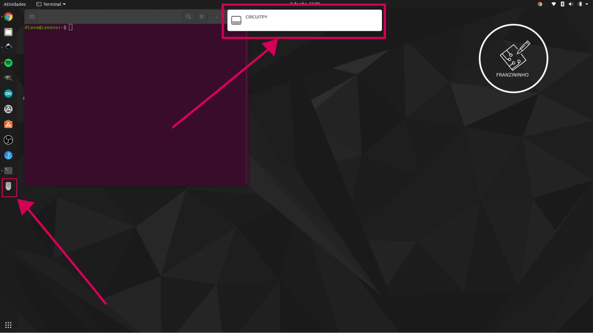

# Primeiros Passos

Para iniciar no CircuitPython é importante você entender como interagir com REPL. Nesses primeiros passos vamos aprender a como usar o REPL através do terminal serial.


## Terminal

O primeiro passo é conectar a placa Franzininho Wifi em seu computador e logo irá aparecer algo parecido com um dispositivo de pen drive, conforme a imagem abaixo:


<p id="gdcalert1" ><span style="color: red; font-weight: bold">>>>>>  gd2md-html alert: inline image link here (to images/image1.png). Store image on your image server and adjust path/filename/extension if necessary. </span><br>(<a href="#">Back to top</a>)(<a href="#gdcalert2">Next alert</a>)<br><span style="color: red; font-weight: bold">>>>>> </span></p>





Antes de sair abrindo os arquivos, faça o seguinte passo:


1. Conecte a Franzininho
2. Abra o terminal
3. Instale um terminal, por exemplo, para instalar o picocom, digite os comandos abaixo:

    ```
sudo apt-get update
sudo apt-get install picocom
```


4. Para acessar o terminal serial, digite o seguinte comando: picomcom /dev/ttyACMO de enter.

    

<p id="gdcalert2" ><span style="color: red; font-weight: bold">>>>>>  gd2md-html alert: inline image link here (to images/image2.png). Store image on your image server and adjust path/filename/extension if necessary. </span><br>(<a href="#">Back to top</a>)(<a href="#gdcalert3">Next alert</a>)<br><span style="color: red; font-weight: bold">>>>>> </span></p>


5. Agora aperte  o Ctrl C do teclado e então aparecerá >>>

    

<p id="gdcalert3" ><span style="color: red; font-weight: bold">>>>>>  gd2md-html alert: inline image link here (to images/image3.png). Store image on your image server and adjust path/filename/extension if necessary. </span><br>(<a href="#">Back to top</a>)(<a href="#gdcalert4">Next alert</a>)<br><span style="color: red; font-weight: bold">>>>>> </span></p>


6. No terminal digite: print(“Hello World”) e aperte o enter (você pode escrever qualquer coisa dentro das aspas, então aparecerá o que você escreveu.


<p id="gdcalert4" ><span style="color: red; font-weight: bold">>>>>>  gd2md-html alert: inline image link here (to images/image4.png). Store image on your image server and adjust path/filename/extension if necessary. </span><br>(<a href="#">Back to top</a>)(<a href="#gdcalert5">Next alert</a>)<br><span style="color: red; font-weight: bold">>>>>> </span></p>


7. Agora vamos fazer uma operação matemática, digite um valor | escolha uma operação matemática e digite outro valor, aperte o enter e veja o resultado, conforme a imagem:

    

<p id="gdcalert5" ><span style="color: red; font-weight: bold">>>>>>  gd2md-html alert: inline image link here (to images/image5.png). Store image on your image server and adjust path/filename/extension if necessary. </span><br>(<a href="#">Back to top</a>)(<a href="#gdcalert6">Next alert</a>)<br><span style="color: red; font-weight: bold">>>>>> </span></p>


8. Agora digite o seguinte código no terminal: 

    ```
import board
dir(board)
```


    Então aparecerá o conjunto de pinos disponíveis na Franzininho Wifi.


    

<p id="gdcalert6" ><span style="color: red; font-weight: bold">>>>>>  gd2md-html alert: inline image link here (to images/image6.png). Store image on your image server and adjust path/filename/extension if necessary. </span><br>(<a href="#">Back to top</a>)(<a href="#gdcalert7">Next alert</a>)<br><span style="color: red; font-weight: bold">>>>>> </span></p>


Agora que você já sabe quais são os nomes dos pinos da placa e também interagir com REPL. Podemos fechar o terminal e dar início abrindo o arquivo **code.py** que está na pasta.


<p id="gdcalert7" ><span style="color: red; font-weight: bold">>>>>>  gd2md-html alert: inline image link here (to images/image7.png). Store image on your image server and adjust path/filename/extension if necessary. </span><br>(<a href="#">Back to top</a>)(<a href="#gdcalert8">Next alert</a>)<br><span style="color: red; font-weight: bold">>>>>> </span></p>


