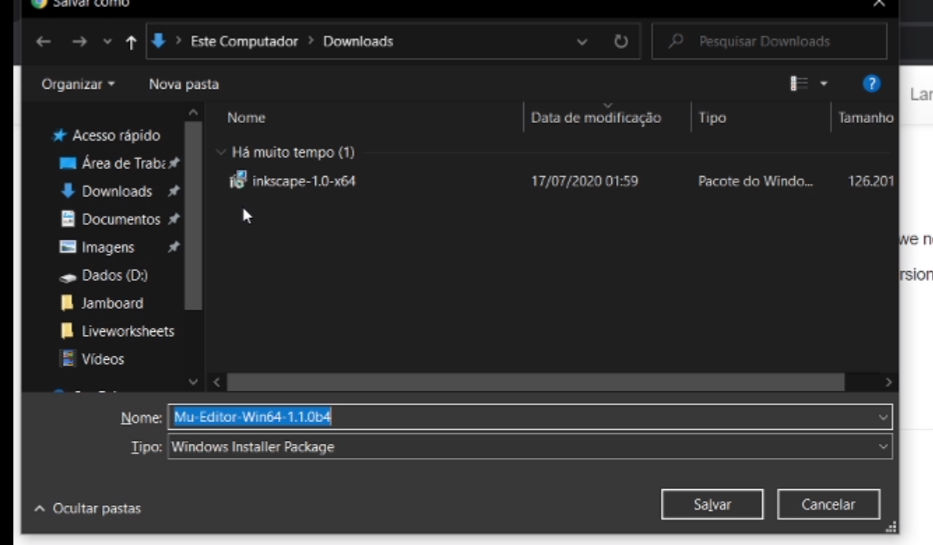
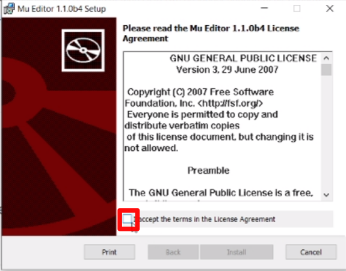
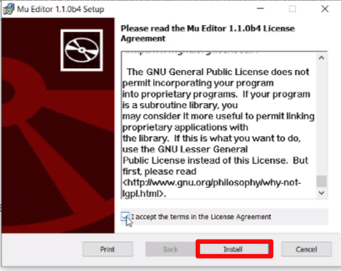
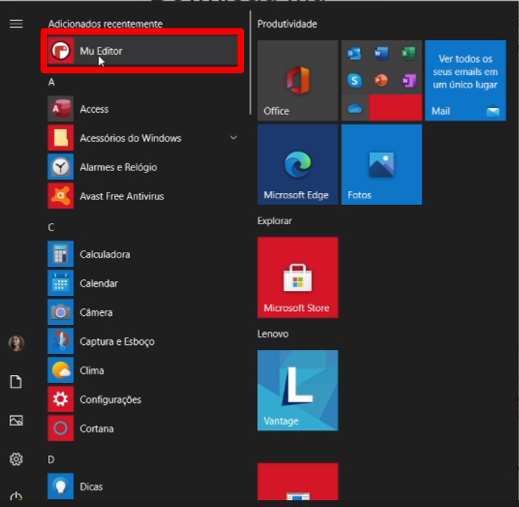
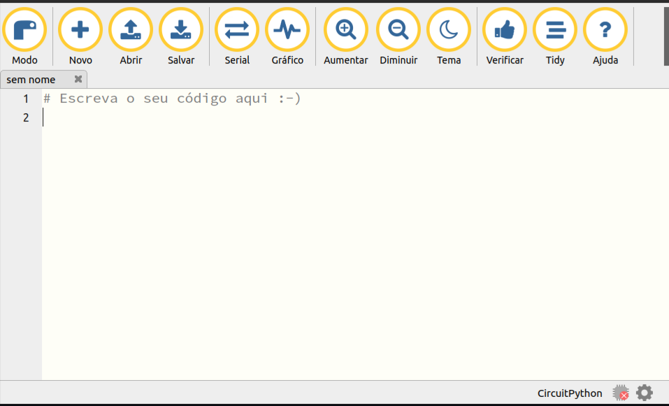
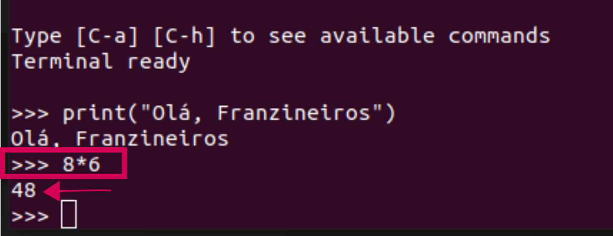
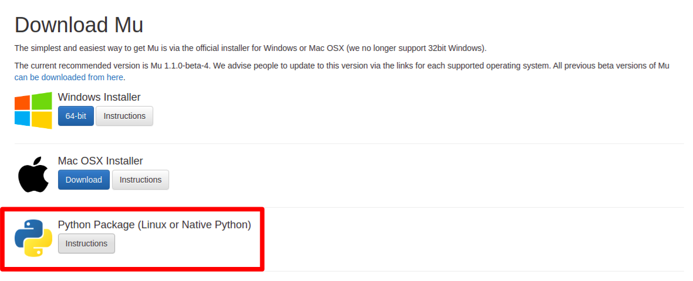

# Primeiros passos

Este documento tem como objetivo ajudá-lo a configurar o Franzininho WIFI para o uso no CircuitPython em seu computador.  Provavelmente ao inserir sua placa apareceu como uma unidade de disco. Confira a seguir mais instruções para o isso!

## Introdução

Antes de começar a diversão de programar a Franzininho WIFI e o CircuitPython, precisamos realizar alguns passos de configuração para determinado sistema. Veja abaixo o sistema e faça o passo a passo!

## Instalação

Nesta etapa vamos preparar o ambiente para você usar sua placa Franzininho WIFI, escolha seu sistema operacional e siga o passo a passo de como fazer esta configuração.

#### Windows

Para a instalação no windows você deve seguir o passo a passo deste tutorial.

1. Acesse o site, acesse este link: https://codewith.mu/ e clique em Download:

   

2. Após isso clique na opção **Windows Installer**.


3. Salve em seu computador.



4. Aguarde até fazer o download e após isso clique em abrir o arquivo que você acabou de baixar.


5. Ao abrir o programa, irá aparecer uma tela onde você terá que aceitar os termos de uso do software, clique na caixa de seleção.



6. Então o botão de **install** será ativado, clique nele.



7. Aguarde a instalação.


8. Procure em seu computador **Mu Editor**



9. Então ao abrir uma janela, escolha **Circuit Python**, conforme a imagem abaixo:


10. Pronto, agora é só se divertir!




### Linux

Para a instalação no Linux você deve seguir o passo a passo deste tutorial

No linux o primeiro passo é interagir com REPL, antes de usar um editor. O primeiro passo é utilizar via terminal serial e depois a como utilizá-lo no editor MU. No próximo tópico vamos aprender a como usar o REPL através do terminal serial.


#### Terminal

O primeiro passo é conectar a placa Franzininho Wifi em seu computador e logo irá aparecer algo parecido com um dispositivo de pen drive, conforme a imagem abaixo:


Antes de sair abrindo os arquivos, faça o seguinte passo:


1 - Conecte a Franzininho

2 - Abra o terminal

3 - Instale um terminal, por exemplo, para instalar o picocom, digite os comandos abaixo:


```
sudo apt-get update
sudo apt-get install picocom
```

4 - Para acessar o terminal serial, digite o seguinte comando: picomcom /dev/ttyACM0 de enter.


5 - Agora aperte  o Ctrl C do teclado e então aparecerá >>>


6 -  No terminal digite: print(“Hello World”) e aperte o enter (você pode escrever qualquer coisa dentro das aspas, então aparecerá o que você escreveu.


7 - Agora vamos fazer uma operação matemática, digite um valor | escolha uma operação matemática e digite outro valor, aperte o enter e veja o resultado, conforme a imagem:





8 - Agora digite o seguinte código no terminal:

```python
import board
dir(board)
```

Então aparecerá o conjunto de pinos disponíveis na Franzininho Wifi.


Agora que você já sabe quais são os nomes dos pinos da placa e também interagir com REPL. Podemos fechar o terminal e dar início abrindo o arquivo **code.py** que está na pasta.


#### Editor Mu

Para a instalação no Linux você deve seguir o passo a passo deste tutorial

1. Acesse o site, acesse este link: https://codewith.mu/

   

2. Clique na opção Python Package (Linux or Native Python)



3. Abra seu terminal e digite o comando abaixo, ele vai instalar bibliotecas do python, aguarde até finalizar:

```
pip3 install mu-editor==1.1.0b4
```   

4. Agora digite este comando:

```
mu-editor

```

Pronto!
